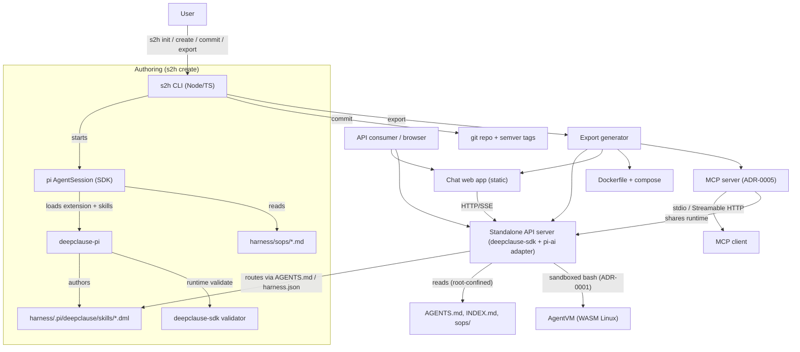

# sop2harness — Design

Status: design (no implementation yet).
Related: [HARNESS_FORMAT.md](HARNESS_FORMAT.md), [EXPORT_RUNTIME.md](EXPORT_RUNTIME.md),
[pi SDK](https://github.com/earendil-works/pi) (`docs/sdk.md`), `deepclause-pi`,
`deepclause-sdk`.

## 1. Vision

Organisations already have procedures written for humans. `s2h` turns those
procedures into a **harness**: a set of validated DeepClause (DML) programs that
a program can run, with a policy router, provenance, and a version history — and
then exports the harness as a small self-hosted API and chat app.

The authoring step is agentic (pi + `deepclause-pi`); the runtime step is
deterministic and portable (`deepclause-sdk`). The harness, not a compiler, is
the product.

## 2. Goals and non-goals

### Goals
- One command to scaffold a harness project (`s2h init`).
- One command to author or update a harness from a prompt and/or SOP files
  (`s2h create`), driven by a real pi agent session with `deepclause-pi` loaded.
- Deterministic validation of every produced artifact before it is accepted.
- Versioning of the harness with messages and semver tags (`s2h commit`).
- One command to produce a ready-to-run API + web chat + MCP server + Dockerfile (`s2h export`).
- A portable harness tool contract so exported harnesses do not depend on pi or
  on arbitrary shell access.
- Safe defaults: read-only export, root-confined file access, shell only inside
  the sandbox, secrets only from the environment.
- Full provenance: SOPs, authoring session, model, and version are recorded.

### Non-goals (for now)
- A general-purpose workflow/automation platform.
- A hosted multi-tenant SaaS.
- A Markdown-to-DML compiler.
- Exposing pi's full tool registry to exported harnesses.
- Fine-grained UI beyond a chat interface and a docs viewer.
- Editing/running the harness directly in the browser (authoring stays in the CLI).

## 3. Key concepts

| Term | Meaning |
| --- | --- |
| **SOP** | A source procedure document: Markdown, PDF, DOCX, HTML, or plain text. |
| **Harness** | The versioned deliverable: `.pi/deepclause/` DML programs, docs, `harness.json`. |
| **Skill** | One DML workflow program (`agent_main`). Lives in `.pi/deepclause/skills/`. |
| **Dispatcher** | The entry skill that routes a request to the right skill (or answers a meta question). |
| **Router / policy table** | The `AGENTS.md` mapping of user wording to skills, also usable by a host agent. |
| **Runtime contract (PHTC)** | The small host-neutral tool set a harness may call at runtime. |
| **Authoring session** | A pi `AgentSession` with `deepclause-pi` loaded, used by `create`. |
| **Export** | Generated standalone server + web app + Dockerfile for a committed harness. |

## 4. Architecture



Layering:

1. **CLI layer** — argument parsing, interactive prompts, progress rendering,
   exit codes. No agent logic.
2. **Authoring layer** — pi SDK embedding, `deepclause-pi` loading, SOP ingestion,
   the authoring prompt, validation, and non-destructive writes.
3. **Versioning layer** — git operations, semver, provenance records.
4. **Export layer** — copies the harness, generates the runtime server, web app,
   Docker assets, and configuration.

The CLI and the exported server share one thing: the harness format. The export
never embeds pi.

## 5. Project layout

```
sop2harness/                     # an s2h project (git repo root)
  s2h.json                       # project config (name, model defaults, paths)
  .gitignore
  .s2h/                          # s2h-owned metadata, not exported
    versions.json                # commit/version provenance
    sessions/                    # authoring transcripts (gitignored)
  harness/                       # THE DELIVERABLE
    harness.json                 # manifest (see HARNESS_FORMAT.md)
    AGENTS.md                    # router/policy table for hosts and humans
    README.md
    sops/                        # ingested SOP sources (provenance)
    .pi/deepclause/
      config.json
      AGENTS.md                  # deepclause authoring guide (seeded)
      DML_REFERENCE.md           # bundled language reference (seeded)
      skills/                    # generated DML programs
      specs/                     # optional behaviour specs
      plans/                     # optional generated plans
  export/                        # generated by `s2h export` (gitignored)
  docs/                          # this project's design docs
```

Rationale: the runtime workspace (`cwd`) for both authoring and execution is
`harness/`, so `deepclause-pi`'s `.pi/deepclause/` conventions and the exported
server's harness root are the same directory. SOPs live inside the harness so
provenance travels with the artifact and `export` bundles them.

## 6. CLI

```
s2h <command> [options]

Commands
  init                       Scaffold an s2h project
  create [request]           Author or update a harness from a prompt and/or SOP files
  commit                     Validate, version, and tag the harness
  export                     Generate a runnable API + web app + Dockerfile
  list                       List skills, versions, and SOPs
  status                     Show project, harness, and version state
  check                      Validate the harness without changing it
  run <skill> [args...]      Run a harness skill locally (debug aid)
  config get|set|list        Read or write project configuration
  doctor                     Check environment, model auth, and tool availability
```

Implementation: `commander` for parsing and `@clack/prompts` for interactive
input; `picocolors` for output. Commands are thin wrappers over the layers.

### 6.1 `s2h init`

```
s2h init [--name <name>] [--model <provider/id>] [--force]
```

Effects:
- Creates `s2h.json`, `.gitignore`, `.s2h/`, `harness/sops/`.
- Seeds `harness/.pi/deepclause/` with `deepclause-pi`'s `AGENTS.md`,
  `DML_REFERENCE.md`, `config.json`, and default skills (non-destructively).
- Creates `harness/harness.json` (name, empty skill list, version `0.0.0`).
- Initializes a git repository at the project root (skips if one exists).
- Never overwrites existing files; `--force` is required to re-seed.

### 6.2 `s2h create`

```
s2h create [request] [--file <path>...] [--name <slug>] [--update]
           [--model <provider/id>] [--context <turn|branch|isolated>]
           [--headless] [--json] [--debug]
```

- `request` is free text describing the SOP or the harness to build. It may be
  combined with one or more `--file` inputs.
- `--update` regenerates or extends an existing harness; without it, `create`
  refuses to overwrite existing skills (it writes new ones only).
- `--headless`/`--json` disable interactive prompts and emit machine-readable
  progress, for CI.

Flow (details in §7):
1. Ingest SOP inputs into `harness/sops/`.
2. Start a pi `AgentSession` with `cwd = harness/`.
3. Load `deepclause-pi` (extension + `handbook-dml` skill) and the `s2h`
   authoring skill.
4. Send the structured authoring request; stream progress to the terminal.
5. Validate every artifact deterministically.
6. Write the manifest and `AGENTS.md` router; record the session; print next steps.

A generated dispatcher DML is optional; routing is defined by the `AGENTS.md`
policy table and `harness.json` triggers (ADR-0003).

### 6.3 `s2h commit`

```
s2h commit [-m <message>] [--major|--minor|--patch] [--no-tag] [--dry-run]
```

- Runs `s2h check` first; refuses to commit an invalid harness.
- Bumps `harness.json.version` (patch by default; `--minor`/`--major` explicit).
- `git add` + `git commit` at the project root; tags `v<version>`.
- Appends `{ version, commit, date, message, session }` to `.s2h/versions.json`.
- `--dry-run` prints the plan only.

### 6.4 `s2h export`

```
s2h export [--out <dir>] [--tag <version>] [--llm pi|openai-compatible]
           [--sandbox agentvm|none] [--mcp|--no-mcp] [--no-web]
           [--allow-effects] [--port <n>]
```

- Validates and resolves the harness (default: current working tree, or a tagged
  version).
- Generates a standalone project: server, web app, MCP server, `Dockerfile`,
  compose, `.env.example`, and a copy of `harness/`.
- `--allow-effects` is required to export a harness that writes external state;
  default export is read-only.
- Shell tools are served by the `agentvm` sandbox (ADR-0001); `--sandbox none`
  rejects shell and produces a slim image.
- The MCP server is on by default (ADR-0005); `--no-mcp` omits it.
- See [EXPORT_RUNTIME.md](EXPORT_RUNTIME.md).

## 7. Authoring flow (`create`)

### 7.1 SOP ingestion

| Input | Handling |
| --- | --- |
| `.md`, `.txt` | Copied and normalised to UTF-8, trailing whitespace trimmed. |
| `.pdf` | `pdftotext` → Markdown (warn if unavailable). |
| `.docx`, `.html` | `pandoc` → Markdown (warn if unavailable). |
| Directory | Ingested recursively, preserving relative paths. |
| URL | Fetched to Markdown via a read-only fetch (opt-in, later). |

Ingested files land under `harness/sops/<slug>/`. A `sops/INDEX.md` records the
source (path/URL), hash, and ingest time. Re-ingesting an unchanged file is a
no-op; changed files are updated and reported.

### 7.2 pi session embedding

`create` uses the pi SDK, not a subprocess:

```ts
const loader = new DefaultResourceLoader({
  cwd: harnessDir,
  agentDir: getAgentDir(),
  additionalExtensionPaths: [deepclausePiExtensionPath],
  additionalSkillPaths: [deepclausePiSkillsPath, s2hSkillsPath],
});
await loader.reload();
const { session } = await createAgentSession({
  cwd: harnessDir,
  model,                 // from --model or s2h.json
  resourceLoader: loader,
  sessionManager: SessionManager.create(harnessDir), // transcript under .s2h
  tools: ["read", "write", "edit", "grep", "find", "ls"], // no bash by default
});
```

- `deepclausePiExtensionPath` / `deepclausePiSkillsPath` are resolved from the
  installed `deepclause-pi` package's `pi` manifest (`extensions`, `skills`).
- Bash is **not** enabled for authoring by default. If an SOP needs an external
  command to ingest, s2h does it itself during ingestion, not through the agent.
- `read`/`write`/`edit` are confined to the project by pi's tools; the agent is
  instructed to touch only `harness/`.

### 7.3 The authoring request

`create` sends one structured request (system context comes from the loaded
`AGENTS.md` files). It instructs the agent to:

1. Read the `handbook-dml` skill and `.pi/deepclause/{AGENTS.md,DML_REFERENCE.md}`.
2. Decompose the SOPs into procedures and propose a skill map (interactive mode
   asks for confirmation; `--headless` records the proposal in the manifest).
3. Author one DML skill per procedure, following
   [HARNESS_FORMAT.md](HARNESS_FORMAT.md). A dispatcher is optional; routing is
   declared in `AGENTS.md`/`harness.json` (ADR-0003).
4. Register the router rows in `harness/AGENTS.md` and the matching `triggers`
   in `harness.json`.
5. Write/merge `harness/harness.json`.
6. Run the SDK validator on every DML file and fix failures.
7. Stop before any destructive or external side effect.

The `s2h` authoring skill (shipped with the CLI) carries the s2h-specific
conventions: the manifest schema, the dispatcher shape, the PHTC tool names, and
the requirement that output is valid DML without a compiler.

### 7.4 Validation gate

Before `create` reports success, all of the following are checked
deterministically (no model):

- every `.dml` parses (`validateWithProlog` from `deepclause-sdk/compiler`);
- every `agent_main` has a static fallback clause;
- `harness.json` matches the schema and references existing skills;
- the router table in `AGENTS.md` and `harness.json.skills[].triggers` agree and
  cover every skill exactly once;
- a dispatcher, if present, references only existing skills;
- no `.deepclause/` was created and no file escaped `harness/`;
- every declared shell tool is covered by a sandbox declaration.

If any check fails, the run exits non-zero with the exact error and leaves the
files for inspection.

### 7.5 Non-destructive writes

- New skills are written with `wx` (fail if present).
- `--update` rewrites only files the agent marks as generated in `harness.json`
  and keeps a timestamped backup under `harness/.pi/deepclause/.backup/<ts>/`.
- User-added skills are never deleted.

## 8. Versioning (`commit`)

- The **project root** is the git repository. Committed paths: `s2h.json`,
  `harness/`, `.s2h/versions.json`, docs. Ignored: `export/`,
  `.s2h/sessions/`, `node_modules/`, `.env`, `*.tgz`.
- `harness.json.version` is the harness version; the git tag is
  `v<version>` (project-wide). ADR-0002 will record whether the tag should be
  prefixed `harness-v`; default now is `v`.
- `.s2h/versions.json` is the machine-readable history used by `s2h status` and
  embedded into exports:

```json
{
  "versions": [
    {
      "version": "1.2.0",
      "commit": "abc1234",
      "date": "2026-09-22T09:00:00Z",
      "message": "add triage workflow",
      "session": "sessions/2026-09-22T08-40-00.jsonl"
    }
  ]
}
```

- `s2h export --tag <version>` can export a specific tag by checking it out into
  a temporary worktree, so exports are reproducible.
- Authoring sessions are transcripts, not part of the harness. They are ignored
  by git but recorded by reference in `versions.json`.

## 9. Export

Details are in [EXPORT_RUNTIME.md](EXPORT_RUNTIME.md). Summary:

- Output: `export/{server,web,harness,Dockerfile,docker-compose.yml,.env.example,README.md}`.
- Server: Node 22, TypeScript compiled to ESM; `deepclause-sdk` runs the harness
  DML; a thin HTTP layer (recommended: `hono` + `@hono/node-server`, or
  `node:http` if a zero-dependency build is preferred).
- LLM: the bundled **pi-ai adapter** is the default `LLMBackend` (ADR-0002),
  resolved from `S2H_LLM_PROVIDER`/`S2H_LLM_MODEL` with provider credentials
  from the environment. An OpenAI-compatible backend remains available for
  gateways. Judge backends mirror `deepclause-pi` (`llm`, optional `jev` via
  `TYPESAFE_API_KEY`).
- Routing: host-side, from the `AGENTS.md` policy table and
  `harness.json.skills[].triggers` (ADR-0003), with a bounded `choose/4`
  judgment for ambiguous requests. A dispatcher DML is optional.
- Tools: the server registers the harness runtime contract
  (`ask_user`, root-confined reads), declared domain tools, and an
  `AgentVM`-backed `bash` tool when the harness needs shell (ADR-0001).
- Web: a single static chat page (vanilla JS/CSS) streaming DML events over SSE,
  with a skills sidebar and a docs viewer.
- MCP: the same runtime is served over MCP (ADR-0005) as one generic
  `s2h__run` tool that routes and runs the harness, streaming progress
  notifications back; Streamable HTTP at `/mcp` and a stdio entrypoint.
- Docker: multi-stage `node:22-slim`, non-root, read-only harness, healthcheck;
  the AgentVM WASM image is included only when the sandbox is enabled.

## 10. Model and authentication

| Context | Model source | Credentials |
| --- | --- | --- |
| `s2h create` | pi `ModelRuntime`: `--model`, else `s2h.json`, else pi default | pi `~/.pi/agent/auth.json` or provider env vars (reused; never copied) |
| `s2h run` (local) | same as `create` | same |
| Exported API | bundled pi-ai adapter: `S2H_LLM_PROVIDER`/`S2H_LLM_MODEL` (ADR-0002); `openai-compatible` optional | provider env vars (e.g. `OPENAI_API_KEY`) or `S2H_LLM_API_KEY` |
| Judge `jev` (any) | `jev-model` from harness config | `TYPESAFE_API_KEY` (env only) |

Rules:
- `s2h` never asks for or stores an API key in the harness or the export.
- The export's `.env.example` lists variable names only, never values.
- Exported images receive secrets via env/`--env-file`, never baked into layers.

## 11. Security model

- **Path confinement.** Every read resolves `realpath` and checks containment
  against the harness root; symlink escapes are rejected (reuse the
  `isInside`/`realpath` pattern from `deepclause-pi`).
- **No host shell in export.** Shell tools execute inside the `AgentVM` sandbox
  (ADR-0001): network off by default, harness mounted read-only, wall-clock and
  output limits, no host secrets. The `pi_bash` compatibility alias uses the same
  sandbox. `--sandbox none` rejects shell entirely. AgentVM is defense in depth,
  not a trust boundary: only non-secret data is mounted and the API process runs
  with least privilege.
- **Skill allowlist.** The server runs only skills listed in `harness.json`.
  There is no endpoint to upload or edit DML.
- **Read-only export by default.** Write/effect tools require an explicit
  `--allow-effects` at export time and, optionally, per-request approval.
- **Prompt injection.** SOP text and user messages are data. Harness DML sets a
  `system/1` role that says so; the server does not splice user text into
  instructions. Imported conversation context is opt-in and off by default.
- **Limits.** Per-run gas/token caps, request size limits, per-session
  concurrency, global concurrency, and timeouts. One active run per session
  (atomic claim, as in `deepclause-pi`).
- **Logging.** No prompt bodies or secrets in logs by default; transcripts are
  opt-in and gitignored.
- **MCP exposure.** The MCP surface exposes one run tool whose routing is
  constrained to manifest skills. Streamable HTTP requires the same bearer token;
  stdio is trusted-local. There is no free-form tool or code execution over MCP.
- **Supply chain.** Minimal dependencies; lockfile committed; Docker build from
  pinned base and `npm ci`.

## 12. Tech stack

| Area | Choice | Notes |
| --- | --- | --- |
| Language | TypeScript, ESM, Node ≥ 22 | Same as the siblings. |
| CLI | `commander`, `@clack/prompts`, `picocolors` | Small, familiar. |
| Authoring | `@earendil-works/pi-coding-agent` (+ `pi-ai`), `deepclause-pi` | SDK embedding, not subprocess. |
| Validation | `deepclause-sdk/compiler` (`validateWithProlog`) | Deterministic gate. |
| Export runtime | `deepclause-sdk` | `createDeepClause`, `runDML`, tool policy. |
| Export LLM | `@earendil-works/pi-ai` adapter (ADR-0002) | Bundled default; OpenAI-compatible alternative. |
| Sandbox | `deepclause-agentvm` (ADR-0001) | Optional WASM Alpine VM for bash; network off by default. |
| Export HTTP | `hono` + `@hono/node-server` | Tiny, typed, SSE-capable. `node:http` fallback. |
| MCP | `@modelcontextprotocol/sdk` (ADR-0005) | One generic run tool, elicitation, progress; Streamable HTTP + stdio. |
| Web | Vanilla JS + CSS, no build step | Served statically by the server. |
| Git | `git` via `execFile` | No heavy git library. |
| Tests | `vitest` | Matches the siblings. |
| Packaging | `tsup`/`tsc` for the CLI; templates for the export | Keep the export self-contained. |

## 13. Testing strategy

- **Unit** — arg parsing, SOP ingestion, manifest schema, path confinement,
  restricted `pi_bash` adapter, semver/tag logic.
- **Golden** — a fixture SOP produces a stable skill set and manifest (with a
  mock LLM backend, so it is deterministic).
- **Integration** — author a fixture harness, `export` it, start the server, and
  hit `/api/chat`, `/api/docs`, and `/api/skills`.
- **Security** — traversal/symlink escapes, shell rejection, oversize requests,
  concurrent-run rejection, secret non-leakage.
- **Docker smoke** (optional CI job) — build the image and curl `/healthz` and a
  trivial `/api/chat` with a stub model.
- **Sibling contract** — tests that pin the `deepclause-pi` extension/skill paths
  and the `deepclause-sdk` tool/event surface, failing loudly when they change.

## 14. Roadmap

| Phase | Deliverable | Exit criteria |
| --- | --- | --- |
| 0 | This design + docs index | AGENTS.md index current; decisions recorded |
| 1 | CLI skeleton, `init`, `check`, `list`, `status` | `s2h init` scaffolds; `check` validates an empty/fixture harness |
| 2 | `create` (prompt + files) | Fixture SOP → validated skills + manifest + `AGENTS.md` router via pi session |
| 3 | `commit` | Semver bump, commit, tag, `versions.json` |
| 4 | `export` runtime + API | Exported server runs a fixture harness over HTTP |
| 5 | Web chat + Docker | One-command export builds and runs; chat streams answers |
| 6 | AgentVM sandbox | Harness with a shell step runs bash inside AgentVM; isolation tests pass |
| 7 | MCP server | MCP client runs the single `s2h__run` tool, receives progress, and answers an elicitation |
| 8 | Hardening | Security tests, limits, Jev, docs viewer, reproducible tagged export |

## 15. Open questions

1. **Portable tool contract.** New harnesses target the PHTC
   (`read_harness_file`/`list_harness_files`/`ask_user`) and treat `pi_bash` as a
   compatibility alias; should `deepclause-pi` also gain pluggable runtime tools
   so the same names exist during authoring, or is authoring against `pi_bash`
   plus export aliasing sufficient?
2. **Sandbox topology.** One AgentVM per session or a small warm pool? How is a
   harness mounted read-only when `deepclause-agentvm` mounts are read/write —
   tool-layer enforcement, a copied mount, or an upstream read-only mount option?
3. **Sandbox egress manifest.** The exact `harness.json.runtime.sandbox.allow`
   shape (host/port/protocol) and how firewall rules are derived and validated.
4. **Versioning granularity.** Project-wide tags (`v1.2.0`) versus
   harness-prefixed tags (`harness-v1.2.0`) when multiple harnesses could share
   a repository later.
5. **Effects.** What is the first supported write/effect tool family (files,
   HTTP, database), and what does its approval model look like beyond read-only?
6. **Non-interactive authoring.** How much of the "propose and confirm" workflow
   can run headless in CI without human approval?
7. **SOP formats.** Which conversions are mandatory in v1 (`pdftotext`,
   `pandoc`) versus best-effort?
8. **Sessions in export.** Keep the exported server stateless per request, or
   add persisted conversation memory (and if so, where)?
9. **Export image size.** The AgentVM WASM image is large; decide whether the
   sandbox ships as a separate image/tag (`s2h-export:sandbox`) or a shared base.
10. **MCP naming and tasks.** Tool name/prefix when several harnesses are
    deployed behind one MCP client, and whether the MCP tasks API should back
    long-running runs for true resumable streaming.
11. **Elicitation fallback.** Whether the `inputRequired` + `sessionId` fallback
    re-invokes `s2h__run` or a dedicated `resume` tool, and how long a suspended
    MCP session is kept.
