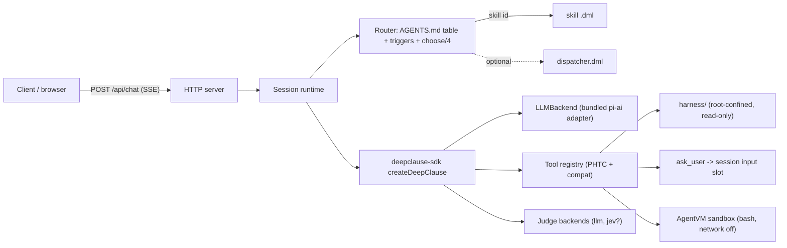

# Export Runtime

`s2h export` turns a committed harness into a standalone, self-hosted API and
chat web app, packaged for Docker. The exported project does **not** depend on
pi; it runs the harness DML with `deepclause-sdk`.

## 1. Generated layout

```
export/
  package.json
  tsconfig.json
  src/
    server.ts            # HTTP + SSE + Streamable HTTP MCP mount
    runtime.ts           # deepclause-sdk wiring, session slots, cancellation
    backend.ts           # LLMBackend implementation (bundled pi-ai adapter)
    tools.ts             # PHTC + compat tools, path confinement, AgentVM sandbox
    harness.ts           # manifest load + validation, skill discovery
    router.ts            # host routing: triggers + choose/4 + optional dispatcher
    mcp.ts               # MCP server: tools, resources, elicitation (ADR-0004)
    mcp-stdio.ts         # stdio entrypoint for desktop MCP clients
  web/
    index.html
    app.js
    styles.css
  harness/               # copy of the committed harness (read-only at runtime)
  .env.example
  Dockerfile
  docker-compose.yml
  README.md
  harness.lock.json      # resolved deepclause-sdk + s2h version, commit, hash
```

`export/` is generated output. Treat it as read-only; re-run `s2h export` to
change it. The harness copy is what runs in production.

## 2. Server architecture



Key properties:
- **One active run per session.** A session owns a single DML execution; a
  second concurrent request for the same session is rejected. A global cap
  limits total concurrent runs.
- **Stateless by default.** Requests carry a `sessionId`; the server keeps an
  in-memory session slot for the lifetime of the process. Conversation memory is
  not persisted unless enabled later (open question).
- **Streaming.** `runDML` yields typed events; the server forwards them as SSE.
- **Cancellation.** A per-session `AbortController`; `/api/chat` and
  `/api/sessions/:id/cancel` can abort.
- **Host routing (ADR-0003).** The server selects a skill from the `AGENTS.md`
  policy table / `harness.json.skills[].triggers`: deterministic trigger match
  first, then a bounded `choose/4` judgment over the candidate skills for
  ambiguous requests, then an optional dispatcher DML (`harness.json.entry`),
  then `ask_user` to clarify. The chosen skill runs with the same request.
- **Sandboxed bash (ADR-0001).** When the harness declares `bash`/`pi_bash`, the
  `bash` tool executes in an AgentVM started lazily per session.

## 3. LLM backend

The harness DML uses `task/N`, `prompt/N`, `llm/2`, and the judge predicates, all
of which need an `LLMBackend` (see `deepclause-sdk`). The export bundles the
**pi-ai adapter** as its default and primary backend (ADR-0002):

- **`pi` (default, bundled).** An adapter built on `@earendil-works/pi-ai`
  (`ModelRuntime`/`complete`) that reuses pi's provider catalog, credentials,
  streaming, tool-call mapping, and provider-state replay. This mirrors
  `deepclause-pi`'s `createPiBackend`. Configured by `S2H_LLM_PROVIDER` and
  `S2H_LLM_MODEL`; credentials come from provider env vars or an injected
  `auth.json`.
- **`openai-compatible` (optional).** A direct HTTP client for
  `/v1/chat/completions`-style APIs with streaming and tool calls. Works with
  OpenAI, Azure, OpenRouter, LiteLLM, vLLM, Ollama-compatible gateways, etc.
  Configured by `S2H_LLM_BASE_URL`, `S2H_LLM_API_KEY`, `S2H_LLM_MODEL`. Selected
  with `S2H_LLM_BACKEND=openai-compatible`.

The backend maps `LLMBackendRequest` → provider request and returns text,
tool calls, usage, and `providerData` (for provider state replay). `onText` emits
streaming chunks.

Judge backends:
- `llm` — wraps the same backend; reports `calibrated: false`.
- `jev` — `createJevJudgeBackend` from `deepclause-sdk`, enabled only when
  `TYPESAFE_API_KEY` is set; reports `calibrated: true`.
- The harness's `judgment` block selects the default and capabilities. A harness
  that calls `require_judgment(calibrated, ...)` must have a fallback clause (it
  should by construction), so it runs correctly on either backend.

## 4. Tools

The runtime registers exactly the tools the manifest declares, using a
`whitelist` policy so nothing else is reachable from DML.

| Tool | Implementation |
| --- | --- |
| `read_harness_file` | `realpath` + containment check, bounded UTF-8 read. |
| `list_harness_files` | Containment check, one directory level. |
| `ask_user` | Pauses the run and resolves when the client posts an input. |
| `bash` | AgentVM sandbox (ADR-0001): network off by default, harness mounted read-only, per-command timeout and output caps. |
| `pi_workspace_list` | Compat: same as `list_harness_files`. |
| `pi_bash` | Compat: runs in the AgentVM sandbox (`bash`). |
| domain tools | Declared in `harness.json`, implemented by the export templates or provided by the operator. Off unless declared. |

### 4.1 AgentVM sandbox

When the manifest declares `bash`/`pi_bash`, the runtime owns one long-lived
`AgentVM` per session (ADR-0001):

- Created lazily on the first shell call and stopped on session disposal or
  process shutdown (`vm.stop()`, which syncs `persistentRoot` first).
- `mounts`: the harness is mounted at `/mnt/harness` (declared `:ro`); a scratch
  `/workspace` may be mounted from `S2H_SANDBOX_DIR` for commands that need to
  write. The tool layer never exposes host secrets.
- `network: false` by default; the manifest can enable it only with an `allow`
  firewall list, applied with `vm.setFirewall({ default: 'deny', rules })`.
  `vm.setNetworkEnabled(false)` is the runtime kill switch.
- `networkRateLimit` is set from `S2H_SANDBOX_NETWORK_RATE` (default 2 MiB/s).
- Each `exec` is bounded by `runtime.sandbox.limits.timeoutMs` and
  `maxOutputBytes`; on timeout the command is abandoned and the run continues
  with a structured error.
- `persistentRoot` is off by default; when enabled it lives under
  `S2H_SANDBOX_DIR`, never inside `harness/`.

Rules:
- No host shell. Shell tools exist only inside the sandbox.
- Every file-tool path argument is resolved and checked; `..` and symlink escapes
  fail.
- Tool output is size-bounded; errors are returned as structured failures to the
  DML, not as process crashes.
- `pi_bash` compat exists only so harnesses authored against `deepclause-pi` keep
  working. New harnesses target PHTC (`read_harness_file`/`list_harness_files`)
  and declare `bash` only when they truly need a shell.

## 5. HTTP API

Base path `/api`. All responses are JSON unless noted. Errors use
`{ "error": { "code": string, "message": string } }` with an appropriate status.

### `GET /healthz`
`200 { "status": "ok", "version": "<harness version>", "uptime": <s> }`.

### `GET /api/harness`
Manifest summary: `{ name, title, description, version, commit, entry, skills[] }`.
Does not expose file contents or secrets.

### `GET /api/skills`
`{ skills: [{ id, title, triggers, effects }] }`.

### `GET /api/docs`
Index of displayable docs from `harness.json.docs`:
`{ docs: [{ name, path, bytes }] }`.

### `GET /api/docs/:name`
Returns `{ name, path, content }` for an allowlisted doc. Path is resolved inside
the harness root; anything else is `404`.

### `POST /api/chat`
Runs the harness entry (dispatcher, then routed skill) for a session.

Request:
```json
{ "sessionId": "optional-client-generated", "message": "She is 34 weeks with bleeding.", "skill": "optional-skill-id", "context": "isolated" }
```

`skill` bypasses routing when the client (or the docs/skills sidebar) already
knows which skill to run.

Response: `text/event-stream` (SSE). Events mirror the DML/runtime events:

```
event: session
data: {"sessionId":"s-1","harness":"who-anc","version":"0.1.0"}

event: route
data: {"skill":"anc-quick-check","reason":"trigger","confidence":null}

event: task_activity
data: {"state":"running","description":"Applying the danger-signs triage..."}

event: stream
data: {"delta":"DANGER SIGN(S) PRESENT"}

event: tool_call
data: {"name":"read_harness_file","state":"completed"}

event: input_required
data: {"prompt":"Confirm this extracted case?"}

event: usage
data: {"inputTokens":1234,"outputTokens":210}

event: answer
data: {"content":"...","skill":"anc-quick-check","detail":null}

event: done
data: {"sessionId":"s-1","ok":true}
```

Errors after acceptance are emitted as:
```
event: error
data: {"code":"runtime_error","message":"..."}
```

### `POST /api/sessions/:id/input`
Resolves the pending `ask_user` for the session.
```json
{ "value": "ok" }
```
`409` if no input is pending; `404` if the session is unknown.

### `POST /api/sessions/:id/cancel`
Aborts the active run. `200 { "cancelled": true }`.

### `DELETE /api/sessions/:id`
Drops the in-memory session slot.

### Limits and validation
- `message` length bounded (default 16 KB); request bodies bounded (default
  256 KB).
- `sessionId` must match `[A-Za-z0-9_-]{1,64}` or be absent (server generates).
- Streaming responses include `Cache-Control: no-store`.
- Optional bearer-token auth via `S2H_API_TOKEN` (constant-time compare).

## 6. MCP server

The exported runtime also serves the harness over the Model Context Protocol
(ADR-0004). It is enabled by default; `s2h export --no-mcp` omits it. The MCP
surface uses the same runtime, limits, sandbox rules, and read-only defaults as
the REST API.

### 6.1 Transports

- **Streamable HTTP** at `S2H_MCP_PATH` (default `/mcp`) on the existing HTTP
  server. Requires the same bearer token as the REST API (`S2H_API_TOKEN`).
- **stdio** via `node dist/mcp-stdio.js` (also reachable as `s2h mcp` for a local
  harness) for desktop clients that spawn a process.

### 6.2 Tools

Tools are generated from `harness.json`: one per skill plus helpers. Names are
MCP-safe (no slashes): `<prefix>__<skill_slug>`, where `<prefix>` defaults to
`s2h` and `<skill_slug>` is the skill id with non-alphanumerics replaced by `_`.

| Tool | Arguments | Returns |
| --- | --- | --- |
| `s2h__<skill_slug>` | `{ message, sessionId?, answer?, context? }` | Final harness answer as text, plus `structuredContent { skill, answer, route?, usage?, inputRequired?, sessionId? }` |
| `s2h__route` | `{ message }` | `{ skill, reason, confidence? }` from the router only |
| `s2h__list_skills` | `{}` | Manifest skills (`id`, `title`, `triggers`, `effects`) |
| `s2h__read_doc` | `{ path }` | Allowlisted doc content |

Registration sketch:

```ts
server.registerTool(`${prefix}__${skill.slug}`, {
  title: skill.title,
  description: `${skill.title}. Matches: ${skill.triggers.join(", ")}.`,
  inputSchema: {
    message: z.string().describe("Natural-language request for this procedure"),
    sessionId: z.string().optional(),
    answer: z.string().optional().describe("Reply to a previous inputRequired prompt"),
    context: z.enum(["turn", "branch", "isolated"]).optional(),
  },
  outputSchema: {
    skill: z.string(),
    answer: z.string(),
    route: z.string().optional(),
    usage: z.object({ inputTokens: z.number(), outputTokens: z.number() }).optional(),
    inputRequired: z.boolean().optional(),
    sessionId: z.string().optional(),
  },
  annotations: { readOnlyHint: true, openWorldHint: false },
}, async ({ message, sessionId, answer, context }, extra) => {
  const result = await runtime.runSkill({ skillId: skill.id, message, sessionId, answer, context, signal: extra.signal });
  return { content: [{ type: "text", text: result.answer }], structuredContent: result };
});
```

Annotations reflect the harness: `readOnlyHint: true` unless the manifest
reports effects; `openWorldHint: true` only when the sandbox allows egress.

### 6.3 Resources

| URI | Content |
| --- | --- |
| `harness://manifest` | `harness.json` (`application/json`) |
| `harness://docs/<path>` | Allowlisted docs (`text/markdown`), same confinement as `/api/docs/:name` |
| `harness://sops/<path>` | Ingested SOP sources (`text/markdown`) |

Only manifest `docs` entries and `sops/` files are listed and readable. Resource
reads are size-capped and root-confined.

### 6.4 `ask_user` → elicitation

When a skill calls `ask_user`, the server prefers MCP elicitation:

```ts
const result = await server.elicitInput({
  message: prompt,
  requestedSchema: {
    type: "object",
    properties: { response: { type: "string", title: "Your answer" } },
    required: ["response"],
  },
});
// result.action: "accept" | "decline" | "cancel"; result.content.response
```

If the client does not support elicitation, the tool returns
`structuredContent { inputRequired: true, sessionId, prompt }` with the question
as text and the run suspended. The client re-invokes the skill tool with
`{ sessionId, answer }` to resume. Suspended sessions are in-memory and expire
with `S2H_MCP_SESSION_TTL_MS` (default 10 minutes). Streamable HTTP sessions are
kept per MCP session id; stdio uses one implicit session.

### 6.5 Progress and cancellation

- When the tool call carries a progress token, map DML `task_activity` and
  `tool_call` events to `notifications/progress`; the final `answer` is the tool
  result.
- Honor the tool callback's `extra.signal` (and Streamable HTTP request abort)
  by aborting the run's `AbortController`, the same path as `/api/sessions/:id/cancel`.
- One active run per MCP session; concurrent calls for the same session are
  rejected with an MCP tool error.

### 6.6 Configuration and client setup

```dotenv
S2H_MCP_ENABLED=true
S2H_MCP_TRANSPORT=both          # http | stdio | both
S2H_MCP_PATH=/mcp
S2H_MCP_TOOL_PREFIX=s2h
S2H_MCP_SESSION_TTL_MS=600000
S2H_MCP_MAX_SESSIONS=32
```

Client examples (key names vary by client):

```jsonc
// Streamable HTTP
{ "mcpServers": { "who-anc": {
  "type": "http",
  "url": "http://localhost:8080/mcp",
  "headers": { "Authorization": "Bearer <S2H_API_TOKEN>" }
} } }
```

```jsonc
// stdio inside the exported image
{ "mcpServers": { "who-anc": {
  "command": "docker",
  "args": ["run", "-i", "--rm", "--env-file", ".env", "s2h-export:who-anc",
           "node", "dist/mcp-stdio.js"]
} } }
```

MCP responses never include secrets, raw prompts, or filesystem paths outside
the harness root. Bearer auth applies to Streamable HTTP only; stdio is
trusted-local and must not be exposed over a network by wrapping it in a socket.

## 7. Web chat app

A single static page served at `/`, no build step, using `fetch` + SSE.

- Header: harness name, version, commit, active model.
- Sidebar: skills from `/api/skills` (clicking one sends a message prefixed with
  its trigger, or selects it via the dispatcher), and a docs viewer reading
  `/api/docs`.
- Chat: streaming assistant text, nested activity for `tool_call` /
  `task_activity`, a usage footer, and a Stop button wired to cancel.
- `input_required` opens an inline prompt; the answer posts to
  `/api/sessions/:id/input`.
- Errors render inline with the error code.

The web app never sees the filesystem directly; everything goes through the
allowlisted API. It is presentation-only: calling DMLs and reading docs.

## 8. Docker

Generated `Dockerfile` (multi-stage):

```dockerfile
# --- build ---
FROM node:22-slim AS build
WORKDIR /app
COPY package.json package-lock.json ./
RUN npm ci
COPY tsconfig.json ./
COPY src ./src
RUN npm run build && npm prune --omit=dev

# --- runtime ---
FROM node:22-slim AS runtime
ENV NODE_ENV=production PORT=8080 S2H_HARNESS_DIR=/app/harness
WORKDIR /app
COPY --from=build /app/node_modules ./node_modules
COPY --from=build /app/dist ./dist
COPY web ./web
COPY harness ./harness
COPY package.json ./
USER node
EXPOSE 8080
HEALTHCHECK --interval=30s --timeout=3s --retries=3 \
  CMD node -e "fetch('http://127.0.0.1:'+(process.env.PORT||8080)+'/healthz').then(r=>process.exit(r.ok?0:1)).catch(()=>process.exit(1))"
CMD ["node", "dist/server.js"]
```

Properties:
- Non-root (`node`), no build toolchain in the runtime layer.
- Serves the REST API, web chat, and the Streamable HTTP MCP endpoint from
  `dist/server.js`; stdio MCP clients run `node dist/mcp-stdio.js` instead.
- `harness/` is copied, not mounted, for immutability; an operator may mount a
  read-only volume over it for updates.
- Secrets are never baked in; pass with `--env-file` or an orchestrator secret.
- `docker-compose.yml` wires `env_file: .env`, a port mapping, a read-only
  container filesystem with a `tmpfs` for `/tmp`, and an optional volume for the
  (future) session store.
- Optional hardening comment block: `read_only: true`, `cap_drop: [ALL]`,
  `security_opt: [no-new-privileges:true]`, and egress restricted to the LLM
  endpoint.

### 8.1 AgentVM sandbox in the image

When the harness declares shell tools, `s2h export` also copies the
`deepclause-agentvm` WASM image into the runtime layer:

```dockerfile
COPY --from=build /app/node_modules/deepclause-agentvm/agentvm-alpine-python.wasm ./agentvm/
ENV S2H_AGENTVM_WASM=/app/agentvm/agentvm-alpine-python.wasm
ENV S2H_SANDBOX_DIR=/var/lib/s2h/sandbox
VOLUME ["/var/lib/s2h/sandbox"]
```

Consequences:
- The WASM image is large (hundreds of MB), so the sandbox is a per-harness
  opt-in. `s2h export --sandbox none` produces a slim, shell-free image.
- The sandbox scratch/`persistentRoot` directory is a volume, never inside
  `harness/`; it is excluded from image layers and from the read-only root
  filesystem.
- The VM runs in a worker thread inside the container; CPU/memory limits are set
  at the container level (`--cpus`, `--memory`).
- Consider a separate base tag (`s2h-export:<ver>-sandbox`) published once and
  reused, so harness images stay small.

## 9. Configuration

`.env.example` (names only):

```dotenv
# Server
PORT=8080
S2H_API_TOKEN=                 # optional bearer token; empty disables auth
S2H_HARNESS_DIR=./harness
S2H_MAX_CONCURRENT_RUNS=2
S2H_REQUEST_MAX_BYTES=262144
S2H_RUN_TIMEOUT_MS=120000

# Model (bundled pi-ai adapter is the default)
S2H_LLM_BACKEND=pi             # or: openai-compatible
S2H_LLM_PROVIDER=openai        # pi-ai provider id
S2H_LLM_MODEL=gpt-4o-mini
S2H_LLM_MAX_TOKENS=4096
# openai-compatible only:
S2H_LLM_BASE_URL=https://api.openai.com/v1
S2H_LLM_API_KEY=

# AgentVM sandbox (only when the harness declares bash)
S2H_AGENTVM_WASM=./node_modules/deepclause-agentvm/agentvm-alpine-python.wasm
S2H_SANDBOX_DIR=/var/lib/s2h/sandbox
S2H_SANDBOX_NETWORK_RATE=2097152

# MCP server (ADR-0004)
S2H_MCP_ENABLED=true
S2H_MCP_TRANSPORT=both         # http | stdio | both
S2H_MCP_PATH=/mcp
S2H_MCP_TOOL_PREFIX=s2h
S2H_MCP_SESSION_TTL_MS=600000
S2H_MCP_MAX_SESSIONS=32

# Optional calibrated judge (TypeSafe System One)
TYPESAFE_API_KEY=
```

Runtime limits (`gasLimit`, `maxTokens`, `context`, `judgment`, `sandbox`) come
from `harness.json`, not the environment, so the deployed harness is the
versioned one. Environment variables only select the host backend and supply
secrets.

## 10. Security checklist

- [ ] Shell runs only inside the AgentVM sandbox; network is off unless an
      `allow` firewall list is declared; harness mount is read-only.
- [ ] All file access is root-confined and realpath-checked.
- [ ] Only manifest-listed skills run; no DML upload endpoint. The MCP surface
      exposes only those skills and allowlisted docs, and Streamable HTTP
      requires the bearer token.
- [ ] Read-only export unless `--allow-effects` was passed.
- [ ] Secrets only from the environment; never in images, logs, or responses.
- [ ] Request size, message length, concurrency, timeout, and sandbox
      output limits enforced.
- [ ] Prompt-injection guidance in every harness `system/1`.
- [ ] Optional bearer auth; TLS terminated by the operator (reverse proxy).
- [ ] `harness.lock.json` records the exact SDK/AgentVM/commit hashes for
      reproducibility.
- [ ] Logs carry no prompt bodies by default.

## 11. Reproducibility

`harness.lock.json` records: s2h version, `deepclause-sdk` version,
`deepclause-pi` version, `deepclause-agentvm` version, harness version + git
commit, and a content hash of `harness/`. `s2h export --tag <version>` checks the
tag out into a temporary worktree before generating, so a given tag always yields
the same harness copy.

## 12. Routing reference

The router used by `POST /api/chat` (ADR-0003):

1. If the request has an explicit `skill`, use it after allowlist validation.
2. Deterministic match: normalize the message and score it against
   `harness.json.skills[].triggers`; a single clear winner wins.
3. Ambiguous: run a bounded `choose/4` judgment over the candidate skills with
   their titles and a short description; require the answer to be one of the
   candidates.
4. If `harness.json.entry` is set, run the dispatcher and let it answer with
   `route:<skill-id>`.
5. Otherwise `ask_user` to clarify.

Every decision emits a `route` SSE event with the skill, the reason, and the
judgment confidence when available. A route to an unknown skill is an error, not
a model answer.
